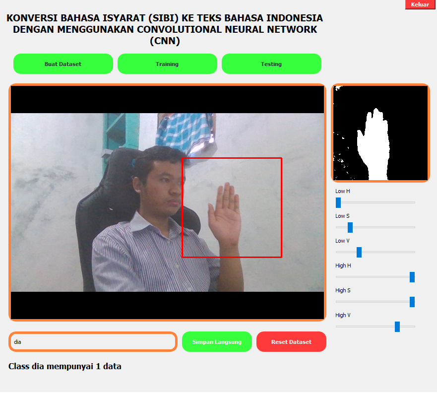
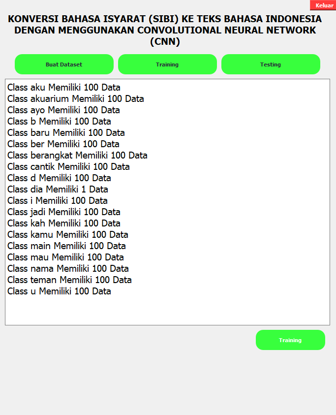
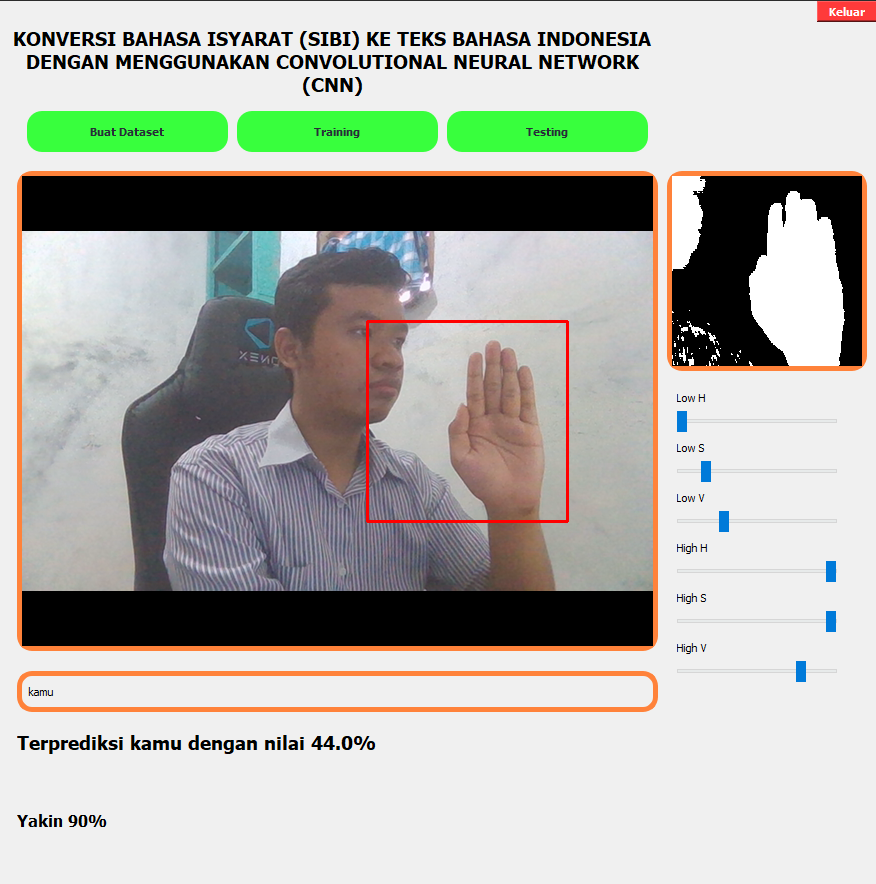
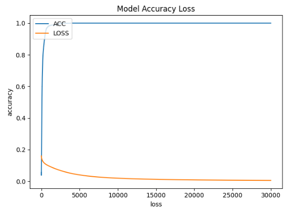
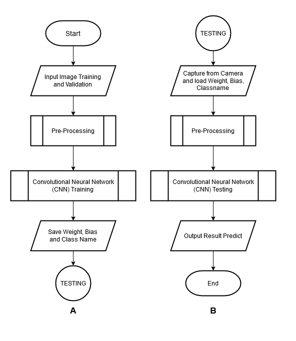
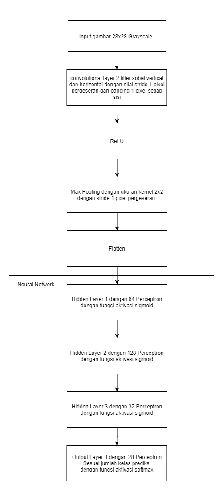

#Khisoft Deep Learning Framework
##Description
ini adalah mini framework untuk membantu dalam membangun model deep learning :smile: .

##Requirement Package
- numpy
- os
- random
- sys
- cv2
- matplotlib

##Features
1. Model Sequential or with add method
2. Convolution2D Layer
3. Maxpooling2D layer
4. ReLU Layer
5. Dense Layer
6. Flatten Layer
7. Summary Model
8. Training with Validation
9. ImageDataGenerator (load from test and train folder)
10. Class to one-hot encoding
11. Auto save and load model weight, bias, architecture model and class mapping
12. Predict method 
14. Plot Accuracy and Loss

##Wish to add
1. Compile method with loss, optimizer and output layer
2. Callback (save best weight only, live plot loss and accuraacy, minimal accuracy and validation accuracy)
3. Add Regularization
4. Add Normalization
5. Add more ability to calculate Tensor

Feel free to Pull Request :heart:

#Khisoft - Sign Language Translator
##Download and Run
[Click this link to download](https://github.com/khisby/Khisoft-Deep-Learning-Framework/releases/tag/v1.0) and then click on Khisoft.-.Sign.Language.Translator.zip read the description for guide. 

##Screenshot
###Create Datasets

###Training

###Testing

###Plot Accuracy and Loss

###Flow System

